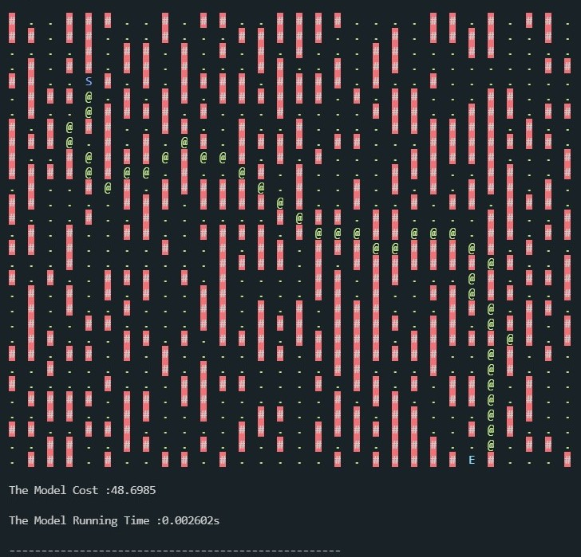
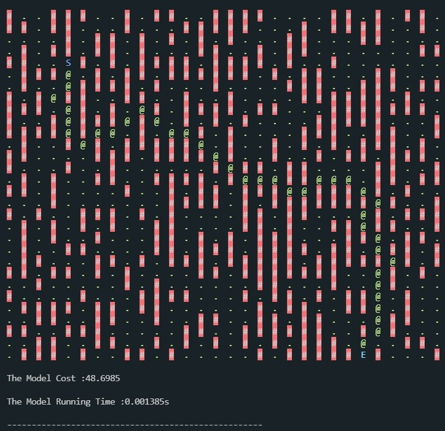
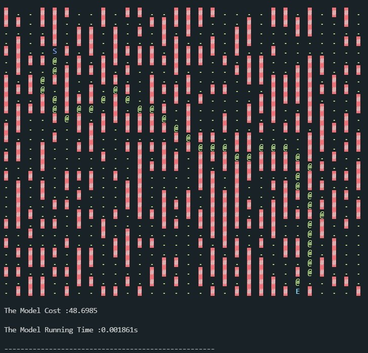
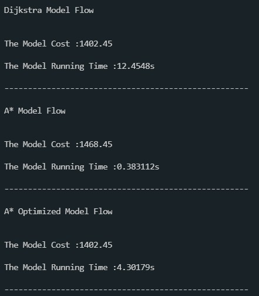
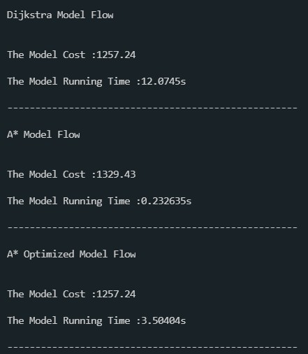
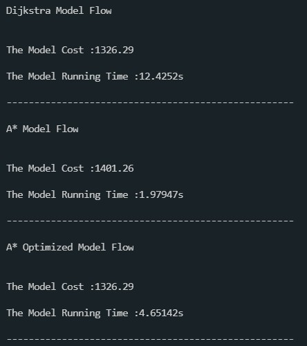

# Search Grid Road

A program for solving the shortest path between two points in the grid.

## 1. Algorithm List

### Dijkstra Model

Dijkstra is a pathfinding algorithm, and use the the movement cost f(x) as the overall evaluation criteria, the configuration of this model is as follows:

* f(x): The distance between the current position and the starting point.

### A* Model

A* algorithm uses the combination of the movement cost f(x) and the estimated cost h(x) as the overall evaluation criteria, the configuration of this model is as follows:

* f(x): The distance between the current position and the starting point.
* h(x): The Manhattan distance between the current position and the endding point.
### Optimized A* Model

Optimize performance by using different functions, the configuration of this model is as follows:

* f(x): The distance between the current position and the starting point.
* h(x): The Integrated distance between the current position and the endding point.

Among them, the comprehensive distance is the comprehensive consideration of Euclidean distance and Manhattan distance.

## 2. Configuration

```shell

git clone https://github.com/dawnli-github/Search-Grid-Road.git

cd Seach-Grid-Road

mkdir build && cd build

cmake ..

make

```

## 3. Demonstration

```shell

./Demonstration

```

## 4. Model Comparison
### Tiny Size Comparison

In the grid area of 30×30, obstacles were randomly inserted for 30×30×(2/3) times (with repetition). 
Finally, the path length and running time of each model were output, as shown in the figure.

#### Dijkstra Model



#### A* Model



#### Optimized A* Model



### Large Size Comparison

In the grid area of 1000×1000, obstacles were randomly inserted for 1000×1000×(2/3) times (with repetition). 
Finally, the path length and running time of each model were output, as shown in the figure.

#### A first random test



#### A second random test



#### A third random test

